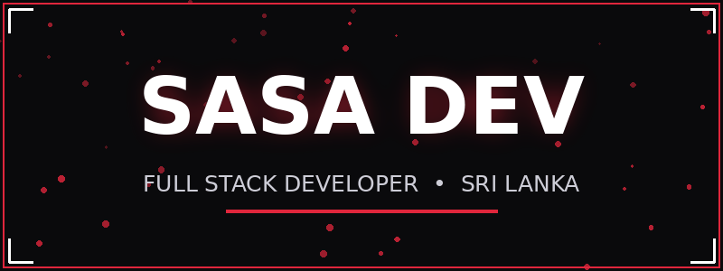
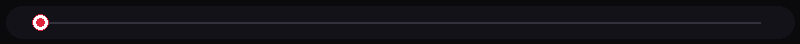
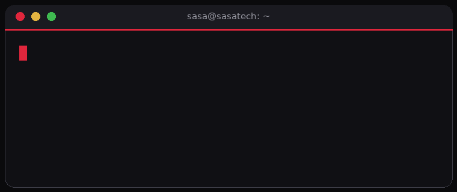

  

  
  
  
  

Hi, I'm **Sasa Dev** (`darksasa1-eng`) — a self-taught **Full Stack Developer** from **Sri Lanka**, working with clients worldwide. Founder of **SasaTech**.

- Building live platforms: APIs, AI apps, dev tools and automation
- Specialised in **web apps, REST APIs, WhatsApp/Telegram bots** and **graphic design**
- Security-first mindset — clean code, hardened deployments
- Currently open for **freelance projects**

Check out my work: **[sasa-dev.pages.dev](https://sasa-dev.pages.dev)**

 

  

<table>
  <tr>
    <td width="50%" valign="top">
      <h3 align="center"><a href="https://www.sasa-dev-api.xyz">Sasa Dev API</a></h3>
      
Free REST API platform — downloaders, AI endpoints, dev utilities.

      

        
        
        
      

    </td>
    <td width="50%" valign="top">
      <h3 align="center"><a href="https://www.sasa-ai.xyz">Sasa AI</a></h3>
      
AI chat web app with history and a fast backend API.

      

        
        
        
      

    </td>
  </tr>
  <tr>
    <td width="50%" valign="top">
      <h3 align="center"><a href="https://www.sasatech.online">SasaTech</a></h3>
      
Developer tools platform — temp mail, downloaders, utilities.

      

        
        
        
      

    </td>
    <td width="50%" valign="top">
      <h3 align="center"><a href="https://scrapyxiter.store">Scrapyxiter</a></h3>
      
Data extraction and web automation toolkit.

      

        
        
        
      

    </td>
  </tr>
  <tr>
    <td width="50%" valign="top">
      <h3 align="center"><a href="https://suddaxcheatzx.store">Suddax Cheatzx</a></h3>
      
Gaming tools and resources store.

      

        
        
        
      

    </td>
    <td width="50%" valign="top">
      <h3 align="center"><a href="https://mail.sasatech.online">SasaTech Mail</a></h3>
      
Disposable email — temp inbox in one click, no signup.

      

        
        
        
      

    </td>
  </tr>
</table>

  

  
  

  
  

  

  

---

  
   
  <b>Let's build something great together.</b>

